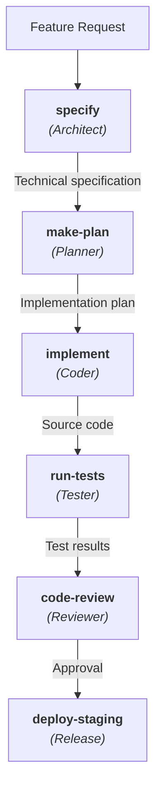

# Agent Skills 101: a practical guide for engineers

> Build once, deploy everywhere. Skills are the universal way to teach AI agents _how_ to do your team's work.

---

## What problem do skills solve?

AI agents are increasingly capable, but they lack the context they need to do _your_ work reliably. They do not know your team's conventions, your internal tools, your deployment process, or your testing strategy. Every time someone types a long prompt explaining how to "run our specific linting pipeline" or "generate a migration for our ORM setup", that knowledge evaporates when the session ends.

Skills solve this by packaging procedural knowledge - the kind of step-by-step expertise that lives in a senior engineer's head - into portable, version-controlled files that agents load on demand. Think of a skill as an onboarding guide for a new hire, except the new hire is an AI agent that can read and follow instructions instantly.

Here is the key insight: a skill is not a configuration file. It is not a prompt template. It is a _procedure_ - a set of instructions that tells an agent how to accomplish a specific task the way your team does it.

## The open standard: `SKILL.md`

Agent Skills follow an [open specification](https://agentskills.io) built around one simple idea: a directory containing a `SKILL.md` file. That single format works across 20+ agent platforms, including Claude Code, GitHub Copilot in VS Code, Cursor, Gemini CLI, OpenAI Codex, Windsurf, Roo Code, Cline, Goose, and many others. You build a skill once, and it runs everywhere your engineers work.

The `SKILL.md` file has two parts:

1. YAML frontmatter (metadata)
2. Markdown body (instructions)

Here is the simplest possible skill:

```plaintext
my-skill/
  SKILL.md
```

```markdown
---
name: commit-message-generator
description: >
  Use when generating commit messages or reviewing staged changes.
  Handles conventional commits format, scope detection, and breaking change notation.
---

# Commit Message Generator

## Workflow

1. Read the staged diff using `git diff --cached`
2. Identify the primary change type (feat, fix, refactor, docs, test, chore)
3. Detect the scope from the modified file paths
4. Write a subject line under 72 characters
5. If the diff touches public APIs, add a BREAKING CHANGE footer

## Format

The commit message follows Conventional Commits:

- Subject line: `<type>(<scope>): <description>`
- Body: Detailed explanation of the change
- Footer: `BREAKING CHANGE: <description>` if applicable

## Rules

- Subject line: imperative mood, no period, under 72 characters
- Body: wrap at 80 characters, explain _why_ not _what_
- Footer: reference issue numbers when applicable

## Step by step example

1. Run `git diff --cached` and analyze the output
2. Determine the change type (e.g., `feat` if a new feature is added
3. Extract the scope from file paths (e.g., `auth` if changes are in `src/auth/`)
4. Write the subject line (e.g., `feat(auth): add login endpoint`)
5. If the diff includes changes to `src/api/public/`, add a breaking change footer
```

That is a complete, functional skill. An agent can discover it, understand when to use it, load the full instructions, and follow the procedure.

## How skills work: progressive disclosure

This is the single most important concept to understand about skills, and the one most often misunderstood. Skills _do not_ dump their entire content into the agent's context window at startup. They use a three-phase loading model called [Progressive Disclosure](https://platform.claude.com/docs/en/agents-and-tools/agent-skills/best-practices#progressive-disclosure-patterns):

**Phase 1 - Metadata (always loaded).** When a session starts, the agent reads only the `name` and `description` from the frontmatter of every available skill. This costs roughly 100 tokens per skill - cheap enough to have dozens of skills installed without bloating context.

**Phase 2 - Instructions (loaded on activation).** When the agent decides a skill is relevant to the current task (based on the description matching the user's request), it loads the full body of the `SKILL.md` file. The specification recommends keeping this under 5,000 tokens (roughly 500 lines).

**Phase 3 - Resources (loaded on demand).** If the skill references additional files (scripts, templates, reference documentation), those are only loaded when the agent needs them. A skill directory can include `scripts/`, `references/`, and `assets/` subdirectories, but their contents stay untouched until explicitly accessed.

This architecture matters because context windows are a finite, expensive resource. Every token spent on irrelevant skill instructions is a token unavailable for understanding the user's code. Progressive disclosure ensures skills scale: you can install fifty skills and the agent only pays the full cost for the ones it activates. Another problem - attention window pollution - is also mitigated. The agent's attention is focused on the relevant instructions, not distracted by dozens of other skill bodies.

Here is a more complete directory structure for a skill with supporting files:

```plaintext
code-reviewer/
  SKILL.md                    # Required: metadata + instructions
  scripts/
    lint-check.sh             # Loaded only when the skill references it
  references/
    style-guide.md            # Loaded only when needed for deep review
  assets/
    review-template.md        # Template for review comments
```

## The description field: your skill's discovery trigger

The `description` field in the frontmatter is far more important than it appears. It is not documentation. It is not a summary for humans. It is a **trigger** - the mechanism by which the agent decides whether to activate your skill.

This is the number one mistake skill authors make, and understanding why it fails requires understanding the progressive disclosure model from the inside.

When a user asks an agent to "review the PR for the payments service", the agent scans all available skill descriptions looking for a match. If your description already explains the workflow ("Analyzes git diff, identifies issues, generates review comments in conventional format"), the agent may conclude it already understands what to do and _skip loading the full skill body entirely_. The model is optimizing for token efficiency - if the description told it the procedure, why would it spend tokens reading the detailed instructions?

This is not a bug. It is rational behavior from the model's perspective. But it means your carefully crafted workflow inside the skill body never gets read.

**A real failure case.** Consider a skill with this description:

```yaml
description: "Code review between tasks - analyzes diff, checks for issues, generates review"
```

When activated, the agent performed a single cursory review instead of following the skill's detailed flowchart that included separate passes for logic errors, style violations, security concerns, and test coverage. The description had already told the agent _what to do_, so it skipped the _how_.

The fix was changing the description to a trigger:

```yaml
description: >
  Use when reviewing code changes, pull requests, or diffs.
  Handles multi-pass review with security, style, and test coverage checks.
```

Now the description tells the agent _when_ to activate (the trigger conditions) and _what capabilities_ are available (so it knows the skill is worth loading), without revealing the procedure itself. The agent must load the full skill body to learn the workflow.

**Principles for writing effective descriptions:**

The description is injected into the agent's system prompt at session startup, so write it in third person. Phrases like "I can help you" or "You should use this" break the system prompt context. Instead, use declarative forms: "Handles...", "Use when...", "Generates...".

Include the specific keywords users type. Not "Python testing" but "pytest". Not "Word documents" but ".docx files". Not "database queries" but "BigQuery SQL" or "PostgreSQL migrations". The model matches on concrete terms, not abstractions.

Include synonyms and related terms to catch variant phrasings. If your skill handles PDF creation, mention "PDF", "pdf", ".pdf files", "portable document format" - because different engineers phrase the same request differently.

**Controlling over-triggering with negative triggers.** Pushy descriptions solve under-triggering, but sometimes a description is _too_ effective. Your data analysis skill keeps loading when users ask for basic spreadsheet formatting. Your code review skill activates during regular coding sessions.

The fix is adding negative triggers, explicit statements about what the skill should NOT handle:

```yaml
description: >
  Advanced statistical analysis for CSV and Parquet files.
  Use for regression modeling, clustering, hypothesis testing,
  and time-series forecasting. Do NOT use for basic data
  exploration, formatting, or simple aggregation.
```

Negative triggers act as a filter. The agent reads "Do NOT use for basic data exploration" and excludes the skill from those requests. Without this, a broadly worded description pulls the skill into conversations where it adds overhead without value.

To verify your description works, ask the agent: "When would you use the [skill-name] skill?" Compare the response to your intended trigger conditions and adjust until they align.

Keep descriptions under 1,024 characters (the specification limit). Aim for 2-4 sentences. Every extra word costs tokens across every session, even when the skill is never activated.

## Frontmatter: beyond name and description

The frontmatter supports several optional fields beyond `name` and `description`. Use them when they add genuine value, not as decoration.

### Standard fields (work everywhere)

**`name`** (required) - 1 to 64 characters, lowercase letters, digits, and hyphens only. Must match the parent directory name. If your directory is `skills/code-reviewer/`, the name must be `code-reviewer`. A mismatch silently prevents the skill from loading on several platforms.

**`description`** (required) - 1 to 1,024 characters. The discovery trigger, covered in detail above.

**`license`** (optional) - Keep it short: either the name of a standard license or a reference to a bundled LICENSE file.

**`compatibility`** (optional) - Only include this if the skill has genuine environment requirements beyond basic agent capabilities. Most skills do not need this field.

### Experimental fields (limited platform support)

**`allowed-tools`** (optional) - Restricts which tools the agent can use while the skill is active. A code review skill might specify `allowed-tools: [Read, Grep, Glob]` to prevent the agent from accidentally modifying files during review. Currently works on Claude Code and partially on Gemini CLI. Other platforms ignore this field.

### Convention fields (for tooling, ignored by agents)

These fields are not part of the agentskills.io specification. Agents do not read them. They exist for human organization, skill catalogs, and external tooling.

**`tags`** (optional) - A list of keywords for categorization and discovery. Tags help when maintaining a skill catalog or building tooling that filters skills by domain. Example: `tags: [security, compliance, audit]`.

**`triggers`** (optional) - Explicit activation phrases for skill catalogs and documentation. Some community tools use this field to generate searchable indexes. Agents do not use this field for activation - they use only the `description` field. If you want specific phrases to trigger your skill, put them in the description.

**`metadata`** (optional) - A key-value map for additional properties. Useful for custom tooling, team ownership tracking, or organizational metadata. Example: `metadata: { team: platform, priority: high }`.

Here is a frontmatter example using standard fields only (maximum portability):

```yaml
---
name: security-audit
description: >
  Use when performing security reviews, vulnerability assessments, or compliance checks.
  Handles OWASP Top 10, dependency scanning, secrets detection, and access control review.
license: MIT
---
```

Here is an extended example including experimental and convention fields (use when you control the target platform or need catalog metadata):

```yaml
---
name: security-audit
description: >
  Use when performing security reviews, vulnerability assessments, or compliance checks.
  Handles OWASP Top 10, dependency scanning, secrets detection, and access control review.
license: MIT
# Restricts agent to read-only tools (works on Claude Code, partial on Gemini CLI)
allowed-tools:
  - Read
  - Grep
  - Glob
  - WebSearch
# For skill catalogs and tooling - agents ignore these fields
tags:
  - security
  - compliance
  - audit
metadata:
  category: security
  team: platform
---
```

## Designing for success

Before writing a single line of SKILL.md, two design decisions shape everything that follows: what kind of skill you're building, and how you'll know it works.

### Problem-first vs. tool-first design

Skills emerge from two directions, and recognizing which one you're starting from prevents wasted effort.

**Problem-first:** You start with a user's goal. "I need to set up a project workspace." The skill orchestrates whatever tools are needed to accomplish that outcome. The user describes what they want; the skill handles _how_.

**Tool-first:** You start with an available capability. "We have a Jira MCP server connected." The skill teaches the agent your team's conventions for using Jira effectively. The user has access; the skill provides expertise.

Most skills lean one direction. A project onboarding skill is problem-first: the user describes an outcome, and the skill coordinates multiple tools. A Jira workflow skill is tool-first: the user already has Jira access, and the skill adds procedural knowledge.

Knowing which framing fits your use case helps you choose the right structure. Problem-first skills tend toward sequential workflows with clear phases. Tool-first skills tend toward reference patterns with decision trees.

### Three categories of skills

In practice, skills fall into three broad categories. Understanding which category your skill belongs to focuses the design process.

**Document and asset creation.** Skills that produce consistent, high-quality output: documents, code, presentations, designs. These skills embed style guides, templates, and quality checklists. They primarily use the agent's built-in capabilities (code execution, file creation) rather than external tools. Example: a frontend design skill that generates polished UI components following brand guidelines.

**Workflow automation.** Skills that guide multi-step processes requiring consistent methodology. These skills provide step-by-step workflows with validation gates, templates for common structures, and iterative refinement loops. Example: a sprint planning skill that analyzes team velocity, suggests task prioritization, and creates tickets.

**MCP enhancement.** Skills that add procedural knowledge on top of MCP tool access. Without a skill, users connect an MCP server and don't know the optimal usage patterns. With a skill, proven approaches activate automatically. Example: a code review skill that coordinates Sentry error data with GitHub PR analysis to produce actionable fix recommendations.

These categories aren't rigid. Some skills span two categories, and that's fine. The value of the categories is helping you decide _what kind of instructions_ your skill needs. Creation skills need templates and style guides. Automation skills need workflow steps and validation gates. Enhancement skills need domain expertise and error handling for common tool failures.

### Defining success before you start

Before writing the skill body, define what success looks like. Without criteria, you can't tell whether iteration is improving the skill or changing it sideways.

**Quantitative signals you can track:**

- _Trigger accuracy:_ Run 10-20 test queries that should trigger your skill. Track how many times it loads automatically vs. requires explicit invocation. Target: 80-90% correct activation.
- _Workflow efficiency:_ Compare the same task with and without the skill enabled. Count tool calls, messages exchanged, and total tokens consumed.
- _Error rate:_ Monitor tool call failures during test runs. A well-designed skill should handle common error cases without user intervention.

**Qualitative signals to watch for:**

- _Self-sufficiency:_ Does the user need to redirect or clarify mid-task? During testing, note how often you intervene. A good skill reduces interventions to near zero.
- _Consistency:_ Run the same request 3-5 times. Do the outputs have consistent structure and quality? Inconsistency reveals ambiguous instructions.
- _First-try success:_ Can someone unfamiliar with the skill accomplish the task on the first attempt? This tests whether the description triggers correctly and the instructions are self-contained.

These are aspirational targets, not pass/fail thresholds. The goal is to have _something_ to measure against, so each iteration moves in a clear direction.

## Writing the skill body: procedures, not documentation

The body of `SKILL.md` is where your instructions live. This is what the agent reads after deciding to activate the skill. The specification places no format restrictions on the body, but the way you write it dramatically affects how well agents follow your instructions.

The most common mistake is writing documentation instead of procedures. A skill _is not_ a README. It _is not_ a tutorial. It is a set of actionable steps that an agent should execute.

**❌ Documentation style (weak):**

```markdown
# Database Migration Skill

This skill helps with database migrations. Our project uses Drizzle ORM
with SQLite. Migrations are important for keeping the schema in sync
across environments. The migrations directory contains all historical
migration files.
```

**✅ Procedural style (strong):**

````markdown
# Database Migration

## Workflow

1. Read the current schema from `src/db/schema.ts`
2. Compare against the latest migration in `drizzle/migrations/`
3. Generate a new migration:
   ```bash
   npx drizzle-kit generate
   ```
4. Review the generated SQL for destructive operations (DROP, ALTER column type)
5. If destructive operations are found, add a data migration step before the schema change
6. Run the migration against the local database:
   ```bash
   npx drizzle-kit migrate
   ```
7. Verify by running the test suite: `npm test`

## Rules

- Never generate migrations that drop columns without explicit user confirmation
- Always create a backup script before destructive migrations
- Migration file names use the format: `NNNN_description.sql`
````

Notice the difference. The first version explains what things are. The second version tells the agent what to do, in what order, with specific commands and verification steps. Agents are execution engines - give them executable procedures.

**Structure recommendations:**

Start with a workflow section that outlines the main steps. Follow with rules or constraints that apply across all steps. Add specific sections for edge cases, error handling, or conditional logic. Reference external files for lengthy reference material rather than inlining everything.

Use conditional logic when appropriate. Agents handle branching well:

```markdown
## Step 3: Determine Test Strategy

- If the change modifies a public API endpoint:
  - Run the full integration test suite
  - Update the API contract tests
- If the change is internal refactoring only:
  - Run unit tests for affected modules
  - Skip integration tests unless dependencies changed
- If the change touches database models:
  - Run migration tests first
  - Then run the full test suite
```

Include verification steps. Do not assume the agent will check its own work:

```markdown
## Step 5: Validate Output

1. Run the linter: `npm run lint`
2. If linting fails, fix the issues before proceeding
3. Run type checking: `npx tsc --noEmit`
4. Run the relevant test file: `npm test -- --grep ""`
5. If any check fails, diagnose and fix before marking the task complete
```

## Where skills live: storage across platforms

Skills can be stored at three levels, and the storage location determines their scope and sharing model.

**Project skills** are stored inside your repository and shared via version control. Every team member gets them automatically. This is the primary way teams share skills.

| Platform                 | Primary directory              | Also supported               |
| ------------------------ | ------------------------------ | ---------------------------- |
| VS Code / Copilot        | `.github/skills/<skill-name>/` |                              |
| Claude Code              | `.claude/skills/<skill-name>/` |                              |
| Cursor                   | `.cursor/skills/<skill-name>/` |                              |
| Gemini CLI               | `.gemini/skills/<skill-name>/` | `.agents/skills/` (priority) |
| OpenAI Codex             | `.agents/skills/<skill-name>/` |                              |
| Generic (cross-platform) | `.agents/skills/<skill-name>/` |                              |

> **Note:** `.agents/` is emerging as a cross-platform location. OpenAI Codex uses `.agents/skills/` as its primary directory (not `.codex/`). Gemini CLI supports both `.gemini/skills/` and `.agents/skills/`, with `.agents/skills/` taking precedence when both exist. Google Antigravity and OpenCode also use `.agents/` for cross-platform compatibility.

**Personal skills** are stored in your home directory and available across all your workspaces. Use these for personal workflows that are not team-specific.

| Platform          | Primary directory                           | Also supported                 |
| ----------------- | ------------------------------------------- | ------------------------------ |
| VS Code / Copilot | User profile (managed via VS Code settings) |                                |
| Claude Code       | `~/.claude/skills/<skill-name>/`            |                                |
| Cursor            | `~/.cursor/skills/<skill-name>/`            |                                |
| Gemini CLI        | `~/.gemini/skills/<skill-name>/`            | `~/.agents/skills/` (priority) |
| OpenAI Codex      | `~/.agents/skills/<skill-name>/`            |                                |

**Extension/plugin skills** are bundled with IDE extensions or agent plugins. These are distributed through package managers or marketplaces.

When skills share the same name across multiple storage locations, project-level skills take precedence over personal skills, which take precedence over extension skills. This lets teams override default behavior without deleting the original skill.

## Skills vs. everything else

If you have been working with AI agents, you have likely encountered custom instructions, prompt files, `AGENTS.md`, MCP servers, and Cursor Rules. Skills occupy a specific niche in this ecosystem, and understanding the boundaries prevents confusion.

- **Skills vs. Custom Instructions** (`.instructions.md`, `copilot-instructions.md`, User Rules). Custom instructions are always-on rules that apply to every session. They define coding standards, naming conventions, and general preferences. Skills are on-demand capabilities that load only when relevant. Your instruction file says "always use TypeScript and follow our naming conventions". Your skill says "here is the step-by-step procedure for creating a new API endpoint in our specific framework".
- **Skills vs. `AGENTS.md`**. `AGENTS.md` files provide persistent context about your project that the agent reads at session start. They describe architecture, conventions, and project-specific knowledge. Skills are procedural - they describe _how to do something_, not _what something is_. Your `AGENTS.md` explains your project structure and tech stack. Your skill teaches the agent how to execute a specific workflow within that structure.
- **Skills vs. Prompt Files / Commands**. Prompt files (`.prompt.md`) and Cursor Commands (`.cursor/commands/`) are user-invoked templates triggered by slash commands. You type `/create-component` and the prompt runs. Skills are model-invoked - the agent decides when to activate them based on the task at hand. You can also invoke skills manually with `/` in some platforms, but their primary mode is autonomous activation.
- **Skills vs. MCP Servers**. MCP (Model Context Protocol) connects agents to external services - databases, APIs, issue trackers. Skills are procedural knowledge about _how_ to use those connections effectively. Your MCP server provides access to Jira. Your skill teaches the agent your team's workflow for creating, updating, and transitioning Jira issues.
- **Skills vs. Cursor Rules** (`.cursor/rules/`). Cursor Rules use a structured format with frontmatter controlling when they apply (always, intelligently, by file pattern, or manually). Skills follow the universal `SKILL.md` format and are portable across platforms. If you only use Cursor, either approach works. If your team uses multiple tools, skills provide portability.
- **Skills vs. Bundles**. A bundle is a curated collection of skills grouped by role or project type. Bundles are not a separate artifact or spec feature - they are documentation that says "for this role, install these five skills". The bundle concept helps onboarding: instead of presenting fifty skills to a new team member, you point them to the "Backend Developer" bundle. Skills are the atoms; bundles are molecules.
- **Skills vs. Workflows**. A workflow chains multiple skills into a sequence where output from one skill feeds into the next. Skills are standalone procedures. Workflows are documentation that orchestrates them into multi-step pipelines. Your `run-tests` skill and `deploy-staging` skill are independent. Your "Ship to Production" workflow document sequences them: run tests → deploy staging → verify → deploy production.

In practice, a well-organized project uses several of these together. Instructions set the baseline, `AGENTS.md` provides architectural context, skills handle specific procedures, and MCP servers connect external services.

## The "skills replace MCP" myth

When Agent Skills became an [open standard in December 2025](https://www.anthropic.com/engineering/equipping-agents-for-the-real-world-with-agent-skills), a narrative emerged in some developer circles: MCP is now obsolete, Skills do everything MCP does, we can remove our MCP servers. This is a category error - a fundamental misunderstanding of what these technologies provide. The confusion is understandable, because both technologies "extend" what an agent can do. But they extend capabilities in completely different dimensions.

### The essential distinction

Think of it this way: MCP is a power cord. Skills are a user manual.

An MCP server gives the agent the _ability_ to interact with an external system - your database, your issue tracker, your cloud infrastructure. Without that connection, the agent cannot read your production logs or create a Jira ticket, no matter how detailed its instructions are. You cannot describe your way into a database connection. The agent needs live access, and MCP provides that access through a [standardized communication protocol](https://modelcontextprotocol.io/docs/learn/architecture).

A skill teaches the agent _how to use_ that access effectively. Your MCP server connects to Jira. Your skill teaches the agent your team's conventions for writing tickets: which fields matter, how to categorize issues, what information to include in the description, which project keys to use. The skill transforms raw tool access into disciplined, team-aligned behavior.

Neither one replaces the other. They operate at different layers of the stack entirely.

### Where MCP cannot be replaced

Certain capabilities require active, bidirectional connectivity that no amount of documentation can provide. MCP remains essential for these scenarios:

**Live data access.** When an agent needs to query your database, check the current state of a Kubernetes cluster, or read messages from a Slack channel, it needs a live connection. Skills can describe query patterns and proven approaches, but they cannot execute queries. The MCP PostgreSQL server reads data from real tables. A skill about "how to write SQL queries" produces text that looks like SQL - the agent still needs MCP to run it against a real database.

**Real-time streaming.** MCP supports [Server-Sent Events and streaming protocols](https://streamnative.io/blog/introducing-the-streamnative-mcp-server-connecting-streaming-data-to-ai-agents) for continuous data flow. An agent monitoring production logs, processing real-time analytics, or watching a deployment pipeline needs streaming updates as they happen. Skills are static documents loaded once at activation. They cannot stream data.

**Write operations with side effects.** Creating a GitHub issue, sending a Slack message, deploying code to staging - these actions change state in external systems. MCP servers provide the authenticated connections that make these operations possible. A skill can describe your deployment workflow in perfect detail, but without an MCP server (or equivalent tool access), the agent cannot push the deploy button.

**Authentication and authorization.** MCP servers handle OAuth flows, API keys, service account credentials, and permission boundaries. They provide [centralized credential management](https://www.friedrichs-it.de/blog/agent-skills-vs-model-context-protocol/) for team environments where multiple developers share access to the same services. Skills have no authentication layer - they are plain text files that assume tool access already exists.

**Cross-agent communication.** In multi-agent architectures, MCP enables [capability discovery](https://aws.amazon.com/blogs/opensource/open-protocols-for-agent-interoperability-part-1-inter-agent-communication-on-mcp/) where agents negotiate which features they support and how to interact. This coordination requires active protocol participation that static files cannot provide.

### Where skills work better

Skills outperform MCP in scenarios that require teaching rather than connecting:

**Procedural knowledge.** Your team's code review checklist, the steps for creating a database migration, the conventions for writing commit messages - these are procedures that agents must learn, not systems they must connect to. Skills excel at encoding this institutional knowledge in a format agents follow reliably.

**Context efficiency.** MCP tool descriptions consume significant context tokens. One study found that [loading the Sentry MCP server alone consumed approximately 8,000 tokens](https://lucumr.pocoo.org/2025/12/13/skills-vs-mcp/) for tool definitions - before any work began. Skills use progressive disclosure: the description costs roughly 100 tokens per skill, and the full body loads only when activated. For capability-rich environments, skills scale more efficiently.

**Portability and iteration.** Skills are markdown files. You can write them, commit them, review them in pull requests, and iterate on them without deploying any infrastructure. MCP servers require running services, handling connections, and maintaining availability. For solo developers or small teams, the [skills plus CLI approach](https://tty4.dev/development/2025-12-13-skills-or-mcp/) often proves more practical than standing up MCP servers.

**Domain expertise transfer.** When you want to teach an agent how your team handles incident response, the skill format provides a natural structure: workflow steps, conditional logic, verification checkpoints, references to additional documentation. MCP has no equivalent concept for transmitting procedural expertise - it provides tools, not training.

### Where they work together

The most effective agent deployments combine both technologies. [Anthropic's official guidance](https://claude.com/blog/skills-explained) is explicit: "Use both together: MCP for connectivity, Skills for procedural knowledge".

Consider a concrete example. Your company uses Google Drive for document storage. The [Google Drive MCP server](https://github.com/modelcontextprotocol/servers) provides the connection - the agent can list files, read contents, create documents. But your team has conventions: project documents live in specific folder hierarchies, naming patterns encode project codes and document types, certain templates should be used for certain document categories.

A skill captures that expertise:

```markdown
---
name: company-docs
description: >
  Use when creating, finding, or organizing documents in Google Drive.
  Handles folder navigation, naming conventions, and template selection.
---

# Company Document Procedures

## Finding documents

1. Start from the shared "Projects" folder
2. Navigate by project code (format: PRJ-NNNN)
3. Within each project folder, documents are organized by type:
   - /specs - Technical specifications
   - /designs - Design documents and mockups
   - /reports - Status reports and retrospectives

## Creating new documents

1. Identify the document type and corresponding template
2. Copy the template from /Templates/{type}-template
3. Place the copy in the correct project subfolder
4. Rename following pattern: {PRJ-CODE}_{type}_{date}\_{title}
```

The MCP server provides access. The skill ensures that access is used according to your conventions. Neither alone is enough; together, they produce an agent that works with your documents the way your team works with them.

Another real-world example comes from [Sentry's code review skill](https://mcpservers.org/claude-skills/sentry/sentry-code-review), which explicitly complements their MCP server: "Automatically analyzes and fixes detected bugs in GitHub Pull Requests using Sentry's error monitoring data via their MCP server". The MCP server provides the live data feed from Sentry. The skill teaches the agent how to analyze that data and produce actionable fix recommendations.

### When MCP becomes unnecessary

Fair warning: not every MCP use case survives scrutiny. Some teams deploy MCP servers when simpler approaches would work.

**CLI tools already handle it.** If your agent can run `git`, `npm`, `kubectl`, or `aws` via bash, an MCP server wrapping those same CLIs adds complexity without benefit. The agent already has tool access through the shell. A skill teaching effective CLI usage often outperforms an MCP server that re-exposes the same functionality through a different protocol.

**Static data that rarely changes.** Reference documentation, style guides, API schemas - if the data updates infrequently, embedding it in a skill's `references/` directory may be simpler than maintaining an MCP server that serves the same content. MCP excels at live, changing data. For static reference material, the overhead is harder to justify.

**Local development workflows.** Solo developers working on local projects sometimes deploy MCP servers out of enthusiasm for the technology rather than necessity. If you are the only consumer and the tools are already available in your shell, skills provide the knowledge layer without the infrastructure burden.

### The decision framework

When evaluating whether a capability needs MCP, skills, or both, ask these questions:

**Does this require live access to external state?** If yes, MCP (or equivalent tool access). Skills cannot query databases, call APIs, or interact with running systems.

**Does this require teaching a procedure or convention?** If yes, skills. MCP provides tools, not training. Even with perfect tool access, agents benefit from procedural guidance.

**Does this require authentication across a team?** If yes, MCP provides centralized credential management. Skills have no auth layer.

**Does this change frequently enough that embedding static content would become stale?** If yes, MCP can serve fresh data on demand. Skills load what they contain at skill-creation time.

**Can existing CLI tools accomplish this?** If yes, consider whether a skill teaching effective CLI usage is simpler than deploying an MCP server.

Most production environments land on a hybrid: MCP servers for essential integrations (source control, issue tracking, cloud infrastructure), skills for team-specific procedures and conventions. The ratio varies by organization, but the pattern of complementary deployment appears consistently in mature setups.

### The real alternative to MCP

The [SmartScope analysis](https://smartscope.blog/en/blog/mcp-agent-skills-analysis/) captures an important insight: "Skills aren't the replacement - bash and curl are". When developers argue against MCP, they are often arguing for direct CLI access documented through skills, not for skills alone. The debate is about protocol complexity versus shell simplicity, with skills providing the procedural layer in both cases.

This framing clarifies what skills replace: not MCP servers, but the informal knowledge that developers carry in their heads about how to use tools effectively. Skills formalize that knowledge. MCP remains the connectivity layer that provides tool access in the first place.

## Installing and managing skills

**Manual installation** is straightforward: create the directory, add the SKILL.md file, and the agent discovers it automatically on the next session. This is how most teams manage their own skills - version-controlled alongside the codebase.

**CLI installation** using the [skills CLI](https://skills.sh/docs/cli) lets you install community skills from the [skills.sh](https://skills.sh) directory. The CLI runs directly via npx without global installation:

```bash
# Install a skill from the registry
npx skills add vercel-labs/agent-skills

# General pattern: owner/skill-name
npx skills add <owner>/<skill-name>
```

The CLI places skills in the correct directory for your current platform. Browse available skills at [skills.sh](https://skills.sh) - the leaderboard shows popular skills ranked by community usage. For complete CLI documentation, see the [skills.sh docs](https://skills.sh/docs).

> **Note:** "Community" typically means unmoderated. Skills from public registries, GitHub repositories, and leaderboards are not reviewed for quality, accuracy, or safety. Much of what circulates online is AI-generated content of questionable value - vague instructions, incorrect patterns, or procedures that sound plausible but fail in practice. Before installing any external skill, read the `SKILL.md` file yourself. Does the description follow trigger patterns or does it summarize the workflow? Are the instructions procedural or just documentation? Do the scripts actually exist and do what they claim? A few minutes of review prevents hours of debugging why your agent behaves strangely.

**Managing skills in different platforms:**

In **VS Code**, type `/skills` in chat or use the `Chat: Configure Skills` command. The diagnostics view (right-click in Chat > Diagnostics) shows all loaded skills and any errors.

In **Claude Code**, skills are auto-discovered from the storage directories. Use `claude --debug` to see loading errors during startup.

In **Gemini CLI**, skills require explicit user consent before activation - Gemini proposes activation and you approve. Interactive commands in chat:

- `/skills list` - display all skills and their status
- `/skills enable <name>` and `/skills disable <name>` - control activation
- `/skills link <path>` - symlink a skill from a local directory
- `/skills reload` - refresh skill discovery

Terminal commands (`gemini skills`):

- `gemini skills list` - enumerate discovered skills
- `gemini skills install <source>` - install from Git repos, local paths, or .skill files; use `--path` for monorepos
- `gemini skills uninstall <name>` - remove a skill
- `gemini skills enable/disable <name> --scope workspace|user` - control activation scope

In **Cursor**, skills follow the same discovery pattern from `.cursor/skills/`. You can toggle Agent Skills support in Cursor Settings > Rules.

**Validation** before deployment catches common issues:

```bash
# Using the skills-ref reference library
npx skills-ref validate ./my-skill/SKILL.md
```

This checks frontmatter structure, field constraints (name length, character restrictions), and format compliance.

**Maintaining a skill catalog**

When a project accumulates more than ten skills, browsing the filesystem becomes tedious. Maintain a catalog file that lists all available skills with their categories and activation keywords.

A minimal catalog in `docs/SKILL-CATALOG.md`:

```markdown
# Skill Catalog

| Skill                 | Category    | Keywords (from description)                 |
| --------------------- | ----------- | ------------------------------------------- |
| `create-api-endpoint` | Development | "new endpoint", "create route", "add API"   |
| `generate-migration`  | Database    | "migration", "schema change", "drizzle"     |
| `run-tests`           | Testing     | "run tests", "test suite", "jest", "pytest" |
| `security-audit`      | Security    | "security review", "vulnerability", "OWASP" |
| `deploy-staging`      | Release     | "deploy staging", "stage deploy"            |
```

The "Keywords" column documents phrases that activate each skill. These come from the skill's `description` field (which agents read), not from a separate triggers field. The catalog is for humans browsing available skills.

Update the catalog when adding or removing skills. Some teams automate catalog generation by parsing SKILL.md frontmatter across all skill directories.

## Patterns that work

These patterns come from production skills across multiple teams and platforms.

**Pattern: Multi-file skill with supporting resources.** When your procedure needs scripts, templates, or reference material, split them into separate files. The SKILL.md body stays focused on the workflow, and resources load only when the agent reaches the step that references them.

```
api-endpoint-creator/
  SKILL.md
  scripts/
    scaffold.sh
    generate-tests.sh
  references/
    api-conventions.md
    error-codes.md
  assets/
    endpoint-template.ts
    test-template.ts
```

In the SKILL.md body, reference these files with relative paths:

```markdown
## Step 2: Scaffold the Endpoint

Run the scaffolding script to generate the boilerplate:

See `scripts/scaffold.sh` for the implementation.

## Step 4: Apply API Conventions

Follow the conventions documented in `references/api-conventions.md` for:

- URL naming patterns
- Request/response envelope format
- Error response structure
```

Keep referenced files one level deep. Deeply nested structures are harder for agents to navigate.

**Pattern: Restricted tool access for safety.** When a skill should only read or analyze (not modify), use `allowed-tools` to enforce the constraint:

```yaml
---
name: architecture-review
description: >
  Use when reviewing system architecture, analyzing dependencies,
  or evaluating design patterns in the codebase.
allowed-tools:
  - Read
  - Grep
  - Glob
---
```

This prevents accidental modifications during analysis tasks.

**Pattern: Multi-service coordination.** When workflows span multiple services, a skill orchestrates the handoff between them. Without a skill, the user must direct each step manually, remembering which service handles what.

```markdown
## Design-to-development handoff

### Phase 1: Design export (Figma MCP)

1. Export design assets from Figma
2. Generate design specifications
3. Create asset manifest

### Phase 2: Asset storage (Drive MCP)

1. Create project folder in Drive
2. Upload all assets
3. Generate shareable links

### Phase 3: Task creation (Linear MCP)

1. Create development tasks referencing the design specs
2. Attach asset links to each task
3. Assign to the engineering team

### Phase 4: Notification (Slack MCP)

1. Post handoff summary to #engineering
2. Include asset links and task references
```

Each phase passes data to the next: asset URLs from Figma flow into Drive folders, shared links from Drive attach to Linear tasks, and task references appear in Slack notifications. Clear phase separation matters here. Validate at each phase boundary before proceeding. If asset upload fails, don't create tasks pointing to missing files.

**Pattern: Cross-references without force-loading.** Sometimes skills relate to each other. A deployment skill might reference a testing skill. Avoid using `@` syntax to reference other skills - that force-loads the referenced file and burns tokens before they are needed. Instead, use plain text references with explicit markers:

```markdown
## Prerequisites

Before deploying, ensure all tests pass. If tests fail,
follow the procedures in the `test-runner` skill (REQUIRED).

For performance-critical deployments, also consult the
`load-testing` skill (OPTIONAL) for pre-deployment benchmarks.
```

The REQUIRED/OPTIONAL markers tell the agent how to prioritize without forcing immediate loading.

**Pattern: Naming conventions that communicate purpose.** Use gerunds (verb-ing) for process skills and verb-first phrases for action skills:

- `code-reviewing` - an ongoing process with multiple passes
- `generate-migration` - a discrete action that produces output
- `test-debugging` - a diagnostic process
- `create-api-endpoint` - a specific generation task

## Skill bundles

Bundles are a documentation convention, not a specification feature. No agent reads bundle files directly. You create bundles to help humans discover and organize skills.

When a project accumulates dozens of skills, discovery becomes a problem. New team members face a wall of options with no guidance on where to start. Bundles solve this by grouping skills into role-based collections.

A bundle is not a technical artifact - it is a curated recommendation list. You do not "install a bundle". You install the skills, then document which combinations matter for which roles.

**Example bundles by role:**

| Role              | Skills                                                                       |
| ----------------- | ---------------------------------------------------------------------------- |
| Backend Developer | `create-api-endpoint`, `generate-migration`, `run-tests`, `code-review`      |
| Security Engineer | `security-audit`, `dependency-scan`, `secrets-detection`, `penetration-test` |
| Agent Architect   | `create-skill`, `prompt-optimizer`, `agent-debugger`, `mcp-connector`        |
| Release Engineer  | `changelog-generator`, `version-bump`, `deploy-staging`, `deploy-production` |

**Documenting bundles:**

Create a `BUNDLES.md` or add a section to your skill catalog:

```markdown
## Backend Developer bundle

Start here if you work on API development and database operations.

| Skill                 | Purpose                                               |
| --------------------- | ----------------------------------------------------- |
| `create-api-endpoint` | Scaffold new REST endpoints with validation and tests |
| `generate-migration`  | Create and apply database schema changes              |
| `run-tests`           | Execute test suites with coverage reporting           |
| `code-review`         | Multi-pass review for logic, security, and style      |

### Learning path

1. Start with `run-tests` - understand the test workflow first
2. Move to `create-api-endpoint` - the most common daily task
3. Add `generate-migration` when you work on schema changes
4. Use `code-review` when reviewing others' PRs
```

Bundles also support progression. A "Junior Backend" bundle might include three core skills. The "Senior Backend" bundle adds four more. This creates natural learning paths without overwhelming new engineers.

## Composing skills into workflows

Workflows are a documentation and prompting convention, not a specification feature. You create workflow documents that describe skill sequences. Agents follow them when you reference the document or describe a goal that matches the workflow.

Individual skills handle discrete tasks. Workflows chain skills into multi-step pipelines where output from one skill feeds into the next.

The difference matters: a skill is a standalone procedure. A workflow orchestrates multiple procedures toward a larger outcome.

**Example: Ship a feature workflow**



Each step produces artifacts the next step consumes. The specification feeds the planner. The plan guides implementation. Tests verify the implementation. Review validates quality. Deployment ships the result.

**Documenting workflows:**

Create a `WORKFLOWS.md` or `docs/workflows/` directory:

```markdown
## Ship to production workflow

Use this workflow when releasing verified features to production.

### Prerequisites

- All tests pass
- Code review approved
- Staging verification complete

### Steps

1. **run-tests** - Execute full test suite
   - Input: Current branch
   - Output: Test results (must pass to proceed)
   - Skill: `run-tests`

2. **deploy-staging** - Deploy to staging environment
   - Input: Passing test results
   - Output: Staging URL
   - Skill: `deploy-staging`

3. **verify-staging** - Manual or automated verification
   - Input: Staging URL
   - Output: Verification checklist
   - Skill: `smoke-test` (optional)

4. **deploy-production** - Deploy to production
   - Input: Verified staging
   - Output: Production deployment
   - Skill: `deploy-production`

### Abort conditions

- Stop at step 1 if tests fail
- Stop at step 3 if verification finds issues
- Roll back at step 4 if health checks fail
```

**Workflow invocation:**

Workflows are not automatically executed. The agent follows them when you reference the workflow document or describe the goal that matches a workflow. For example:

- "Follow the ship-to-production workflow"
- "I need to deploy this feature to production" (agent matches to workflow)

Some teams create a thin wrapper skill that references the workflow document:

```yaml
---
name: ship-to-production
description: >
  Use when deploying verified features to production.
  Orchestrates testing, staging deployment, verification, and production release.
---
# Ship to Production

Follow the workflow documented in `docs/workflows/ship-to-production.md`.

Load and execute each step in sequence. Stop if any step fails.
```

This pattern keeps the workflow documentation human-readable while giving the agent a clear entry point.

## Testing

A skill isn't finished when it's written. It's finished when it works reliably across different phrasings, contexts, and edge cases. The gap between "looks correct" and "works in practice" is where most skills fail quietly. This section covers proactive testing during development. If you've already deployed a skill and something is wrong, see [Troubleshooting](#troubleshooting).

### Start with one task

The most effective skill authors share a common habit: they iterate on a single challenging task until the agent succeeds, then extract the winning approach into the skill. This is faster than building a comprehensive skill and testing broadly from the start.

The reasoning behind this approach is practical. When you test one task repeatedly, you get fast feedback on what works and what confuses the agent. You learn which instructions the agent follows reliably and which it treats as suggestions. You discover which phrasing produces consistent results. Once the skill handles one task well, expanding to cover related tasks becomes straightforward because you've established a working foundation.

### The three tests every skill needs

After the initial iteration, structured testing catches problems that ad-hoc use misses. Every skill benefits from three categories of tests.

**Triggering tests: does the skill load when it should?**

The description field determines activation, and it fails in two directions. Under-triggering means the skill doesn't load for relevant requests. Over-triggering means it loads for unrelated requests. Both waste the user's time and degrade trust in the skill.

Test with 10-20 queries across three groups:

_Should trigger (obvious phrasing):_

- "Help me set up a new project workspace"
- "Create a project in our system"

_Should trigger (paraphrased):_

- "Initialize a workspace for Q4 planning"
- "I need a new project environment"

_Should NOT trigger:_

- "What's the weather forecast?"
- "Help me write a Python function"
- "Create a spreadsheet"

Track how often the skill activates correctly. If it triggers on fewer than 80-90% of relevant queries, the description needs more trigger phrases or synonyms. If it triggers on unrelated queries, add negative triggers or narrow the description scope.

**Functional tests: does the skill produce correct outputs?**

Once the skill triggers, verify that the agent follows the instructions and produces the expected results:

- Does each step execute in the correct order?
- Are tool calls (MCP or CLI) successful?
- Does the output match the expected format?
- Do edge cases produce reasonable behavior?

Run the same request 3-5 times and compare outputs for structural consistency. If the agent produces different workflows across runs, the instructions are ambiguous somewhere. Find the ambiguous step and tighten the language or add an example.

**Performance comparison: is the skill worth the token cost?**

This test is often skipped, but it answers an important question: does the skill produce better results than a well-crafted prompt?

Compare the same task with and without the skill enabled:

| Metric                  | Without skill | With skill |
| ----------------------- | ------------- | ---------- |
| Back-and-forth messages | 15            | 2-3        |
| Failed tool calls       | 3             | 0          |
| User corrections needed | 4             | 0-1        |
| Total tokens consumed   | 12,000        | 6,000      |

If the skill doesn't meaningfully improve at least one metric, it's adding complexity without delivering value. Simplify the skill or reconsider whether a custom instruction would serve better.

## Anti-patterns

These are the most common mistakes observed in real-world skill repositories. Each one degrades agent performance, sometimes subtly and sometimes catastrophically.

### Workflow summary in the description

This is the most damaging mistake because it short-circuits progressive disclosure. When the description contains the procedure, the agent may never read the full skill body.

**❌ Bad: this IS the workflow, the agent may skip the body:**

```yaml
description: "Analyzes git diff, identifies the change type,
  generates a commit message in conventional format with scope detection"
```

**✅ Good: this tells when to activate and what capabilities exist:**

```yaml
description: >
  Use when generating commit messages or reviewing staged changes.
  Handles conventional commits, scope detection, and breaking change notation.
```

### Generic descriptions that match everything or nothing

Vague descriptions cause two problems: false activations (the skill loads when it should not) and missed activations (the skill does not load when it should).

**❌ Bad: too vague, could match almost any request:**

```yaml
description: "Helps with data processing and analysis tasks"
```

**✅ Good: specific triggers with concrete terms:**

```yaml
description: >
  Use when querying BigQuery, writing SQL for analytics pipelines,
  or optimizing query performance. Handles partitioned tables,
  materialized views, and cost estimation.
```

### README-style documentation instead of procedures

Skills that explain concepts instead of providing step-by-step procedures leave the agent without actionable guidance.

**❌ Bad: explains what things are:**

```markdown
## About Our Testing Framework

We use Jest for unit testing and Playwright for E2E tests.
The test directory contains all test files organized by module.
Jest configuration is in jest.config.ts.
```

**✅ Good: tells the agent what to do:**

````markdown
## Running Tests

1. Identify which modules are affected by the current changes
2. Run unit tests for affected modules:
   ```bash
   npx jest --testPathPattern=""
   ```
3. If changes affect UI components, also run E2E tests:
   ```bash
   npx playwright test --grep=""
   ```
4. If any tests fail, read the failure output and fix before proceeding
````

### Monolithic skills that try to do everything

A single skill that covers "all development workflows" will be enormous, expensive to load, and imprecise in its description matching. Split broad capabilities into focused skills.

Instead of one `development-workflow` skill (hundreds of lines), create separate focused skills: `run-tests`, `create-migration`, `deploy-staging`, `code-review`. Each one loads independently, keeping context costs low and activation precise.

### First or second person in descriptions

The description is injected into the system prompt, which is written in third person. Personal pronouns break the voice.

**❌ Bad: breaks system prompt voice:**

```yaml
description: "I can help you create database migrations"
description: "You can use this to generate API documentation"
```

**✅ Good: third person, declarative:**

```yaml
description: "Generates database migrations for Drizzle ORM with SQLite"
description: "Use when creating or updating API documentation for REST endpoints"
```

### Critical instructions buried in the middle

When the agent loads a skill but skips key steps, the problem is often structural rather than instructional. Agents process long documents with varying attention, and the middle of a 300-line SKILL.md is the most likely place for instructions to be missed.

Three common causes and their fixes:

**Instructions too verbose.** If the body reads like a technical manual, the agent may skim. Cut explanatory prose that doesn't directly support a workflow step. Move reference material to `references/` files.

**Critical information buried.** Put the most important constraints at the top of the body. Use `## Critical` or `## Important` headers for non-negotiable rules. If a constraint like "never drop columns without confirmation" appears halfway through a long file, elevate it to the top.

**Ambiguous language.** "Make sure to validate things properly" gives the agent no actionable guidance. "Run `python scripts/validate.py --strict` and fix all errors before proceeding" does.

For critical validations that the agent occasionally skips, move the check into a script. Code is deterministic; language interpretation isn't. A 10-line validation script will outperform a paragraph of validation instructions every time.

### External dependencies via git clone or network requests

Skills should be self-contained. If the agent needs to clone a repository or download files before the skill can work, the skill is fragile and environment-dependent. Bundle what you need in the skill directory. Move large reference material to `references/` where it loads on demand.

### Command lists without context or verification

A flat list of commands without conditional logic, error handling, or verification steps produces brittle workflows.

**❌ Bad: no conditions, no verification, no error handling:**

```markdown
1. Run `npm run build`
2. Run `npm run test`
3. Run `npm run deploy`
```

**✅ Good: conditions, verification, error handling:**

```markdown
1. Run the build: `npm run build`
   - If the build fails, read the error output and fix before proceeding
2. Run the full test suite: `npm run test`
   - If tests fail, fix the failures. Do not proceed to deployment with failing tests
3. Verify the build artifact exists: `ls dist/`
4. Run a smoke check: `node dist/index.js --health-check`
   - If the health check fails, investigate the build output
5. Deploy to staging first: `npm run deploy -- --env staging`
6. Verify staging deployment: `curl https://staging.example.com/health`
7. Only after staging verification succeeds, deploy to production
```

## Troubleshooting

When a skill doesn't behave as expected, resist the urge to rewrite it from scratch. Most problems fall into a handful of categories, and each has a targeted fix. Start by identifying which symptom matches your situation.

### Skill doesn't activate

**Symptoms:** The agent ignores the skill entirely. You have to mention the skill by name or manually enable it for the agent to load it.

**Diagnose:** Ask the agent: "When would you use the [skill-name] skill?" If the agent can't describe the skill's purpose accurately, the description isn't registering.

**Common causes:**

- Description is too vague. "Helps with projects" matches nothing. Add specific trigger phrases that real users would type.
- Missing synonyms. Engineers phrase the same request differently. If the skill handles PDF creation, mention "PDF", ".pdf files", "document generation", and "portable document format".
- Keyword mismatch. The description uses abstract terms ("data processing") while users type concrete ones ("parse CSV", "BigQuery query"). Match the vocabulary your users use.

**Fix:** Rewrite the description with specific trigger phrases and test with 10-20 varied queries. See [The description field](#the-description-field-your-skills-discovery-trigger) for the full treatment.

### Skill activates too broadly

**Symptoms:** The skill loads for unrelated requests. Users disable it or work around it.

**Diagnose:** Track which unrelated queries trigger the skill. Look for overly broad keywords in the description.

**Common causes:**

- Description uses general terms that match many domains ("processes data", "creates documents").
- No negative triggers to exclude adjacent use cases.

**Fix:** Narrow the scope with specific qualifiers and add explicit exclusions: "Advanced statistical analysis for CSV files. Do NOT use for basic data exploration or simple formatting." See [Controlling over-triggering with negative triggers](#controlling-over-triggering-with-negative-triggers) in the description section.

### Skill loads but the agent skips steps

**Symptoms:** The skill activates correctly, but the agent performs a shallow version of the workflow instead of following the detailed instructions.

**Diagnose:** Check whether the description summarizes the procedure. If the description already explains _what to do_, the agent may conclude it has enough information and skip the skill body entirely.

**Common causes:**

- Description leakage: the description contains the workflow ("Analyzes git diff, identifies the change type, generates a commit message"). The agent treats the description as sufficient and doesn't read the full instructions.
- Critical steps buried in a long body. Agents process long documents with varying attention. Constraints in the middle of a 300-line file get missed.
- Instructions too verbose. When the body reads like a technical manual, the agent skims for the actionable parts.

**Fix:** Rewrite the description to communicate _when_ to activate and _what capabilities_ exist, not _how_ the workflow proceeds. Elevate critical constraints to the top of the body. Cut explanatory prose that doesn't directly support a workflow step. See the [Workflow summary in the description](#workflow-summary-in-the-description) and [Critical instructions buried in the middle](#critical-instructions-buried-in-the-middle) anti-patterns.

### Inconsistent results across runs

**Symptoms:** The same request produces different workflows or outputs in different sessions. Sometimes the skill works correctly, sometimes it doesn't.

**Diagnose:** Run the same request 3-5 times and compare outputs side by side. Find the step where results diverge.

**Common causes:**

- Ambiguous language at a decision point. "Process the file appropriately" means different things in different contexts. The agent interprets the ambiguity differently each time.
- Multiple valid approaches without a clear default. "You can use either pdfplumber or PyMuPDF" forces the agent to choose, and it chooses differently across sessions.
- Missing examples. Without input/output pairs showing the expected behavior, the agent falls back on its general training, which varies.

**Fix:** Tighten the language at the inconsistent step. Replace "process the file" with "run `python scripts/process.py input.pdf`". Declare one default approach per task. Add multishot examples that demonstrate the expected output format.

For critical steps where consistency is non-negotiable, move the logic to a script. Code execution is deterministic; language interpretation isn't. A `python scripts/validate.py` call produces the same result every time. A paragraph of validation instructions can drift in interpretation across sessions.

### Performance degradation with many skills

**Symptoms:** Agent responses feel slower. Quality degrades even for tasks unrelated to any specific skill. Context seems crowded.

**Common causes:**

- Too many skills enabled simultaneously. Each skill's description costs ~100 tokens at startup. With 50+ skills, that's 5,000+ tokens of description metadata before the conversation starts.
- Large skill bodies loading unnecessarily. A skill that triggers broadly loads its full body often, consuming context that other tasks need.
- All content inlined instead of using progressive disclosure. A 2,000-line SKILL.md with everything in the body defeats the three-level loading model.

**Fix:** Audit which skills are actively used. Disable skills that activate fewer than once per week. Move reference material from the body to `references/` files. Keep frequently-activated skill bodies under 200 words. See [Token efficiency](#token-efficiency-why-size-matters) for size guidelines.

---

## A complete skill example

Here is a production-quality skill that demonstrates the patterns discussed above. It handles creating new API endpoints in a Next.js application with specific team conventions.

```plaintext
create-api-endpoint/
  SKILL.md
  references/
    api-conventions.md
    error-codes.md
  assets/
    route-template.ts
    test-template.ts
```

**SKILL.md:**

```markdown
---
name: create-api-endpoint
description: >
  Use when creating new API routes, REST endpoints, or server-side handlers
  in Next.js App Router. Handles route creation, validation, error handling,
  TypeScript types, and test scaffolding.
---

# Create API Endpoint

## Prerequisites

- Confirm the endpoint path and HTTP methods with the user
- Check that no existing route conflicts with the proposed path

## Workflow

### 1. Plan the Route

Determine the route file location based on the URL pattern:

- `/api/users` maps to `src/app/api/users/route.ts`
- `/api/users/[id]` maps to `src/app/api/users/[id]/route.ts`

### 2. Define Types

Create TypeScript types for request and response bodies in
`src/types/api/.ts`:

- Request body type (for POST/PUT/PATCH)
- Response body type
- Query parameter type (for GET with filters)

### 3. Create the Route Handler

Use the template structure from `assets/route-template.ts`.

Every handler must:

- Validate request body with zod schema
- Return consistent envelope: `{ data, error, meta }`
- Use appropriate HTTP status codes (see `references/error-codes.md`)
- Include try/catch with structured error logging

### 4. Add Error Handling

Follow the error response conventions in `references/api-conventions.md`:

- 400 for validation failures (include field-level errors)
- 401 for missing authentication
- 403 for insufficient permissions
- 404 for missing resources
- 500 for unexpected errors (log full error, return generic message)

### 5. Create Tests

Use the template from `assets/test-template.ts`.

Every endpoint needs:

- Happy path test for each HTTP method
- Validation failure test (malformed body)
- Authentication test (missing/invalid token)
- Not-found test (for endpoints with path parameters)

Run tests to verify: `npm test -- --testPathPattern="api/"`

### 6. Verify

1. Run the linter: `npm run lint`
2. Run type checking: `npx tsc --noEmit`
3. Run the new tests
4. If all checks pass, summarize what was created
```

## Token efficiency: why size matters

Every token in your skill costs real money and real performance. The description is loaded for every session, even when the skill is never activated. The body is loaded on activation. Referenced files are loaded on access.

Practical guidelines based on the specification and real-world usage:

- **Description**: Under 1,024 characters. Aim for 2-4 sentences.
- **Frequently-loaded skills**: Keep the SKILL.md body under 200 words (~300 tokens). These are skills that activate in most sessions (like code style or commit message skills).
- **Standard skills**: Keep the body under 500 lines (~2,000-3,000 tokens). This covers most workflow skills.
- **Complex skills**: If the body exceeds 500 lines, split reference material into `references/` files that load on demand.

The progressive disclosure model only works if you respect the size boundaries. A 2,000-line SKILL.md with everything inlined defeats the purpose - the agent pays the full token cost every time the skill activates, even if it only needs one section.

## Getting started: your first skill in 10 minutes

1. **Pick a task you explain repeatedly.** What procedure do you describe in Slack messages, PR comments, or onboarding docs more than once a month? That is your first skill.

2. **Create the directory:**

   ```bash
   mkdir -p .github/skills/my-first-skill
   ```

3. **Write the SKILL.md:**

   ```markdown
   ---
   name: my-first-skill
   description: >
     Use when [specific trigger condition].
     Handles [specific capabilities].
   ---

   # My First Skill

   ## Workflow

   1. [First step with specific command or action]
   2. [Second step]
   3. [Verification step]

   ## Rules

   - [Important constraint]
   - [Edge case to handle]
   ```

4. **Test it.** Start a new chat session and give the agent a task that matches your description. Watch whether the skill activates and whether the agent follows your procedure. If it does not activate, refine your description keywords. If it activates but skips steps, check whether your description accidentally summarizes the workflow.

5. **Commit and share.** Push the skill directory to version control. Your entire team gets it automatically.

## Quick reference: specification constraints

| Field               | Portability   | Requirement                                                            |
| ------------------- | ------------- | ---------------------------------------------------------------------- |
| `name`              | All platforms | 1-64 chars, lowercase, digits, hyphens only; must match directory name |
| `description`       | All platforms | 1-1,024 chars; loaded at startup for all skills                        |
| `license`           | All platforms | Optional; standard license name or LICENSE file reference              |
| `compatibility`     | All platforms | Optional; environment requirements                                     |
| `allowed-tools`     | Limited       | Optional; restricts agent tool access (Claude Code, partial Gemini)    |
| `tags`              | Tooling only  | Optional; for catalogs/tooling only; agents ignore                     |
| `triggers`          | Tooling only  | Optional; for catalogs/tooling only; agents ignore                     |
| `metadata`          | Tooling only  | Optional; key-value map for tooling; agents ignore                     |
| `SKILL.md` body     | All platforms | No format restrictions; recommended under 500 lines                    |
| File references     | All platforms | Relative paths from skill root; keep one level deep                    |
| Directory structure | All platforms | `SKILL.md` (required), `scripts/`, `references/`, `assets/` (optional) |

## Platform-specific notes

**VS Code / GitHub Copilot**: Skills are generally available as of January 2026. Use `/skills` or `Chat: Configure Skills` command to manage. The diagnostics view shows loaded skills and errors. Extension authors can contribute skills via the `chatSkills` contribution point in `package.json`.

**Claude Code**: Skills auto-discover from `.claude/skills/` (project) and `~/.claude/skills/` (personal). The `allowed-tools` frontmatter is fully supported. Use `claude --debug` for troubleshooting. Skills are also available in Claude.ai for paid plans.

**Cursor**: Skills load from `.cursor/skills/` at the project level. Enable or disable Agent Skills in Cursor Settings > Rules > Import Settings. Install community skills with `npx skills add` or create/copy them by hand.

**Gemini CLI**: Skills require explicit activation with user consent. The `/skills` command manages enable/disable state. Built-in `skill-creator` skill helps generate new skills. Once activated, skills remain active for the full session.

**OpenAI Codex**: Skills load from `.agents/skills/` (project, scanning up to repo root) and `~/.agents/skills/` (personal). Codex uses `.agents/` not `.codex/` for skill storage. Invoke skills explicitly with `$skill-name` syntax. Built-in `$skill-creator` and `$skill-installer` skills help with authoring and installation. Configure enabled/disabled state in `~/.codex/config.toml`. When duplicate skill names exist across locations, both appear in selectors (not merged). Supports symlinked skill folders.

### Experimental feature support matrix

| Feature                | Claude Code | VS Code/Copilot | Cursor | Gemini CLI | Codex CLI |
| ---------------------- | ----------- | --------------- | ------ | ---------- | --------- |
| `allowed-tools`        | Full        | No              | No     | Partial    | No        |
| Progressive disclosure | Full        | Full            | Full   | Full       | Full      |
| Skill validation       | Full        | Full            | Full   | Full       | Partial   |

"Partial" means the feature is recognized but behavior may differ from the specification.

## References

- Agent Skills specification: https://agentskills.io/specification
- GitHub Copilot Agent Skills: https://docs.github.com/en/copilot/concepts/agents/about-agent-skills
- Cursor Skills documentation: https://cursor.com/docs/context/skills
- Claude Code Skills documentation: https://code.claude.com/docs/en/skills
- Claude Agent Skills (platform): https://platform.claude.com/docs/en/agents-and-tools/agent-skills/overview
- Anthropic reference skills: https://github.com/anthropics/skills
- OpenAI documentation on skills: https://developers.openai.com/codex/skills/
- OpenAI reference skills: https://github.com/openai/skills
- VS Code skills documentation: https://code.visualstudio.com/docs/copilot/customization/agent-skills
- Gemini CLI skills: https://geminicli.com/docs/cli/skills/
- Skills CLI for installation: https://skills.sh
- Community skills: https://github.com/github/awesome-copilot
